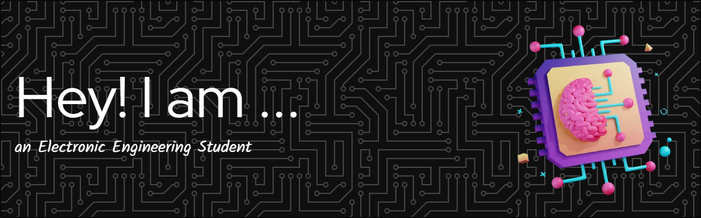

-Motivated and forward-thinking engineering student with a passion for building products,Quantum Computing, Artificial Intelligence 
and Robotics.A quick learner with interested for staying up-to-date with the latest industry trends and technologies.

<h2 align="left">📚 I'm Currently Learning</h2>
<h4 align="left">Pontificia Universidad Javeriana</h4>

* Energy Conversion

* Applied Physics in Electronics

* Entrepreneurship and Technology

<h2 align="left"> 💡 About Academic Projects</h2>

<h4 align="left">Electromyography Sensor</h4>

Check out the Github repository:

<h3 align="left">Connect with me:</h3>

<h3 align="left">Languages and Tools:</h3>

     

